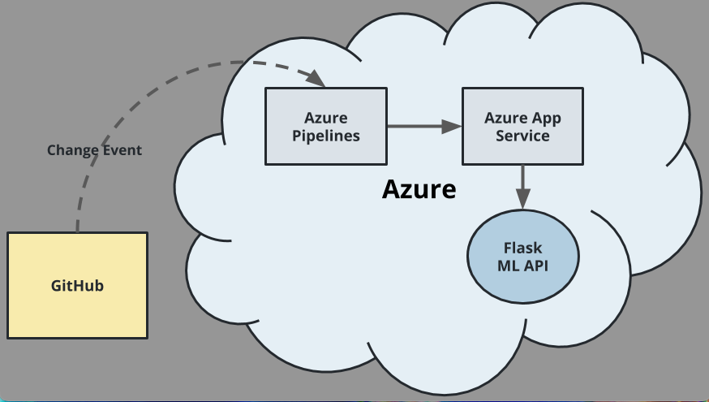
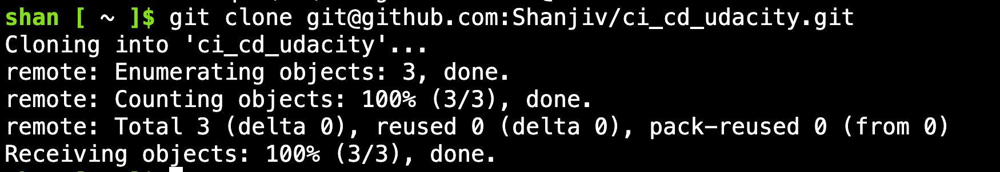
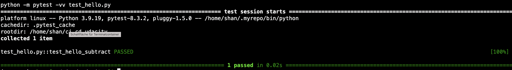
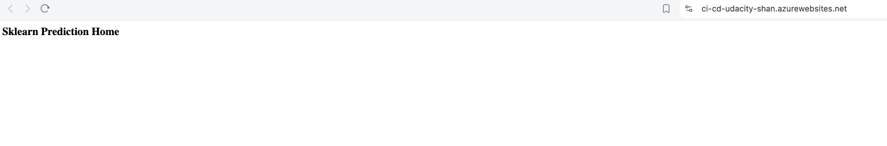
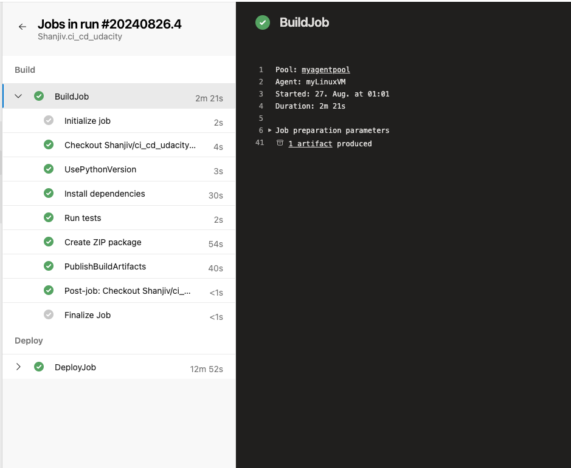
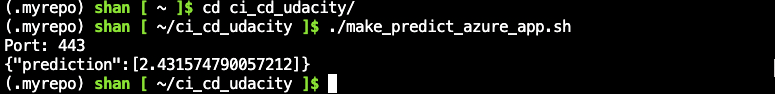
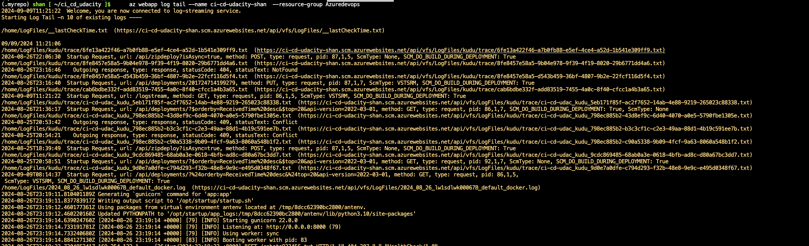

# Overview

This project demonstrates the deployment of a Flask machine learning application to Azure App Services, utilizing Azure Pipelines for continuous integration and continuous deployment (CI/CD). The application predicts housing prices using a pre-trained machine learning model.

## Project Plan

- **Trello Board**: [Link to Trello Board](<https://trello.com/invite/b/66cb31460463c109026458a4/ATTI913d8b5d37aa9f5f33dadba2fecdb6d6F0E5DF65/udacity-board>)
- **Project Plan Spreadsheet**: [Link to Project Plan](<https://docs.google.com/spreadsheets/d/1MeaFSpnKaqYc1oUi7KAGFZoGGMZVdHVnMz2N1sabxWQ/edit?usp=sharing>)

## Instructions

### Architectural Diagram

Below is the architectural diagram that shows how the key components of the system work together:

)

### Steps to Run the Project

Follow these instructions to set up and run the project:

1. **Clone the Project Repository**
   - Open Azure Cloud Shell.
   - Clone the repository:
     ```bash
     git clone https://github.com/Shanjiv/ci_cd_udacity.git
     cd ci_cd_udacity
     ```
   - **Screenshot**: Project cloned into Azure Cloud Shell
   - 

2. **Set Up Python Environment**
   - Set up a virtual environment and install dependencies:
     ```bash
     python3 -m venv venv
     source venv/bin/activate
     pip install -r requirements.txt
     ```

3. **Run Tests**
   - Execute the tests defined in the `Makefile`:
     ```bash
     make all
     ```
   - **Screenshot**: Passing tests that are displayed after running the `make all` command from the `Makefile`
   - 

4. **Deploy to Azure App Service**
   - Use the Azure CLI to deploy the application:
     ```bash
     az webapp up --name <your-webapp-name> --resource-group Azuredevops --location westeurope
     ```
   - **Screenshot**: Project running on Azure App Service
   - 

5. **Set Up CI/CD with Azure Pipelines**
   - Follow the official documentation to set up continuous deployment:
     [Azure DevOps CI/CD Setup](https://docs.microsoft.com/en-us/azure/devops/pipelines/ecosystems/python-webapp?view=azure-devops)
   - **Screenshot**: Successful deploy of the project in Azure Pipelines
   - 

6. **Verify Deployment and Predictions**
   - Run the prediction script to verify that the deployment was successful:
     ```bash
     ./make_predict_azure_app.sh
     ```
   - Expected output:
     ```bash
     udacity@Azure:~$ ./make_predict_azure_app.sh
     Port: 443
     {"prediction":[20.35373177134412]}
     ```
   - **Screenshot**: Successful prediction from deployed Flask app in Azure Cloud Shell
   - 

7. **Monitor Logs**
   - Stream the application logs:
     ```bash
     az webapp log tail --name <your-webapp-name> --resource-group Azuredevops
     ```
   - **Screenshot**: Output of streamed log files from deployed application
   - 

## Enhancements

To improve the project in the future, consider the following enhancements:

- Implement additional endpoints for more machine learning models.
- Add authentication and authorization features to secure the API.
- Integrate with a database to persist predictions and model metadata.
- Optimize the CI/CD pipeline for faster deployment times.

## Demo of workflow

Watch a screencast of the project in action on YouTube: [Project Demo](<TODO: Insert Screencast YouTube link>)
